# Monte Carlo Localization for Vex V5RC Robotics

<p align="center">
  
</p>


**Hi 👋🏿 My name is Apia Okorafor, Former Programmer for team 1082R, now Computer Science Student at the University of Texas at Austin. This is my code and explanation for my implementation of Monte Carlo Localization in Vexcode Pro V5.**

#### Credit to $${\color{purple} Maxx \space Wilson | GHOST}$$, $${\color{red} Benjamin \space | 687D}$$, and [Autonomous Mobile Robotics Laboratory](https://amrl.cs.utexas.edu/interactive-particle-filters/) for the tremendous help in the creation of my code

---

Monte Carlo Localization can be highly useful for improving the robustness and accuracy of the robot’s position tracking, especially in environments with uncertainty or complex features. Since VEX robots often operate in known environments, MCL allows the robot to maintain accurate localization by sampling multiple points of its position and refining them based on data from the distance sensors.

### DISCLAIMERS!!!
1. For our implementation, our map is rotated 90° clockwise (So that 0° is facing the ```+y``` direction), and turning clockwise is positive (+θ) and counterclockwise is negative (-θ), same as the Odometry paper by 5225A.
2. My code does have a really weird naming scheme. I know I'm just weird. 🤷🏿‍♂️

**MOST IMPORTANT**

3. This white paper provides an introductory overview of particle filters and Monte Carlo localization, designed for educational purposes and within the context of VEX V5RC Robotics. While I strive to have this be a rigorous explanation of the algorithm, I highly suggest reading some actual academic sources as a supplement to this whitepaper. Some good sources are listed at the end of the paper.

### Particles

The basis of MCL is the particle filter, where a “particle” is just a representation of the state of the robot. Since we know the state of the robot (or the robot variable we care about) are ```X, Y, and Theta```, we made a **Struct** to be a lightweight object to use for our particles.

<p align="center">
  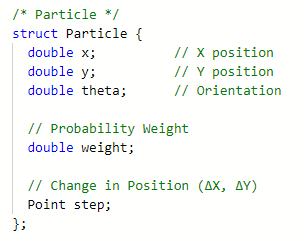
</p>

### Sensors

For MCL, the sensors we use are distance sensors. We created a custom class specifically for the MCL Distance Sensors to be able to only need to measure once every loop, adjust for the offsets from the sensors, and keep everything in one place.

<p align="center">
  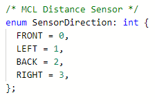
</p>
<p align="center">
  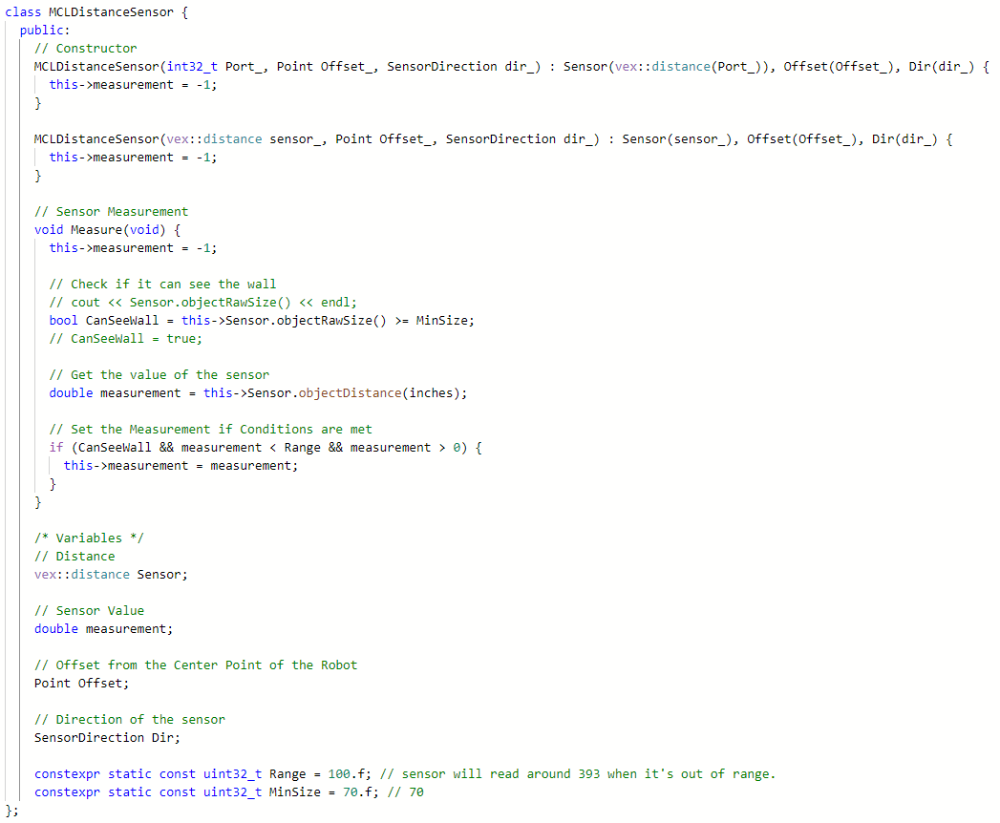
</p>

## Field

For the map of the field, we created our own Field class, which holds all the information we need about the field to be able to understand our map.

### Game Objects (Mobile Goals)

* The ```Goal``` struct represents a mobile goal, which has:
  * ```Position```: A ```Point``` representing the goal's position on the field.
  * ```RadiusSquared```: The squared radius of the goal for fast distance calculations.
  * A constructor that initializes the goal’s position and stores the squared radius.

### Constructor

* The ```Field``` constructor initializes the field with a predefined set of four mobile goals, located at ```(±24, 0)``` and ```(0, ±24)```, each with a radius of ```2``` inches.

### Field Properties and Functions

* ```GetSize()```: Returns the full length/width of the field by doubling ```HalfSize```.
* ```AddGoal(Point P, float R)```: Adds a new mobile goal to the ```Goals``` vector with a given position and radius.

### Sensor Distance Measurement

* ```get_sensor_distance(Particle& p, const MCLDistanceSensor& Sensor)```:
  * **Sensor Position Calculation:** Computes the sensor's position based on the particle's position and sensor offset.
  * **Step Vector Calculation:** Rotates the particle’s motion vector based on the sensor’s direction.
  * **Goal Intersection Check:**
    * Determines if the sensor’s path intersects any goal using vector projections.
    * If the sensor’s heading points toward the goal and the perpendicular distance is within the goal’s radius, calculate the intersection distance.
  * **Wall Intersection Calculation:**
    * If no goal is hit, calculate the distance to the nearest vertical or horizontal wall.
    * Uses trigonometry to determine the intersection point.

### Field Constants

* ```HalfSize```: Represents half the field’s size (```140.875 / 2```), used for wall calculations.
* ```direction_to_sine``` and ```direction_to_cosine```: Lookup tables for sensor direction calculations.

As well as the ```HalfSize``` of the field as for our purposes, the middle of the field is (0, 0), so the furthest distance possible is +- 72 inches. This class is designed for the MCL, where the robot’s sensors need to detect mobile goals and walls. By efficiently calculating distances to objects, it helps navigation

<p align="center">
  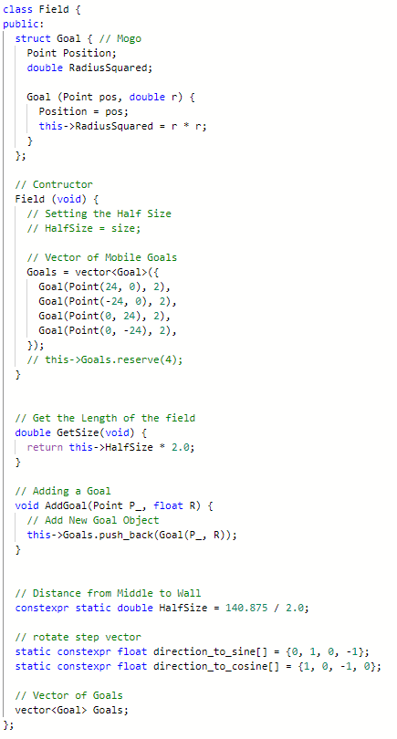
</p>

The most important part of this field class is the function

``` cpp
get_sensor_distance(Particle& p, const MCLDistanceSensor& Sensor)
```

This function takes in a particle and a corresponding distance sensor object to be able to calculate the expected value of that sensor to be used in the **update step.**

It uses some clever math to be able to do so, as described here

Let $d$ be the distance to the wall. Let $\theta$ be the sensor heading. We can take advantage of the square shape of the field to determine the distance to the wall.

For a vertical wall:

$x+d * \cos{\theta}=x_{wall}\rightarrow d=(x_{wall} - x)/\cos{\theta}$

Using that, and Intersection occurs if $|y + d * sin(θ)| < y_{max}$.

$|y + sin{\theta}| < y_{max}$

Horizontal walls are similar.

<p align="center">
  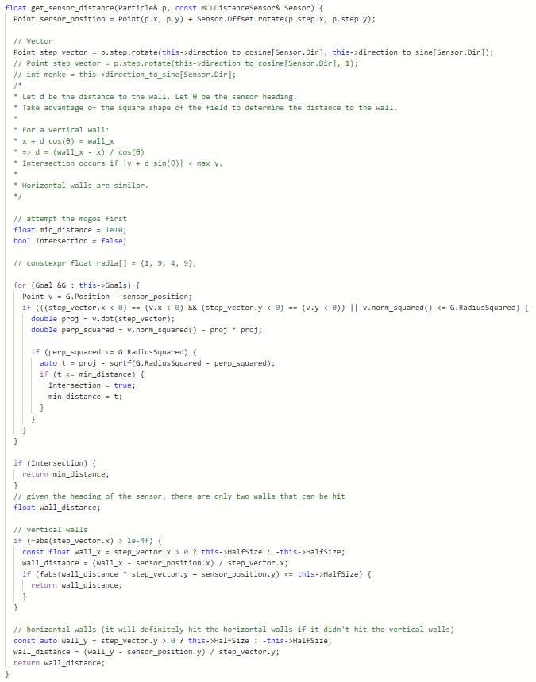
</p>

---

# Initialization

The ```StartMCL``` function initializes the Monte Carlo Localization (MCL) process by creating and distributing particles around the robot's starting position. It sets up the initial belief of the robot’s position by adding noise to the given ```(x_, y_, theta_)``` values. This function generates a set of particles that approximate the initial position of the robot. Each particle represents a possible state of the robot with small variations in position and orientation.

<p align="center">
  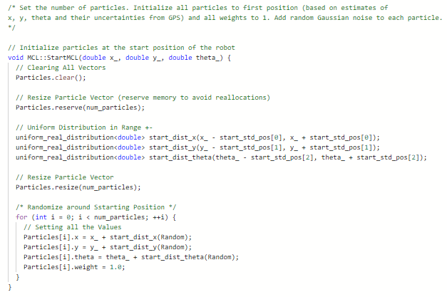
</p>

# Main Algorithm

## Predict

The prediction section of the MCL is responsible for predicting the next state of each particle based on the robot's motion model. It propagates the particles forward according to the robot’s estimated velocity while incorporating random noise to account for uncertainty.

1. **Get the Robot’s Average Velocity**
   * ```Velo = getAvgVelocity() * VeloScale;```
   * Computes the average velocity of the robot and scales it with ```VeloScale``` to ensure the motion model is properly adjusted.
   * The robot’s average velocity from the getAvgVelocity() function is an average of all the motor RPM’s which need to be scaled into inches per second to properly add to the ```X, Y``` coordinates, which are in inches. To properly convert RPM into in/sec, the conversion rate (VeloScale) must be calculated through the following equation:

$${\frac{({rpm}_{\text{motors}} * \pi)}{60} * \text{Wheel Diameter} * \text{Drivebase Gear Ratio}}$$

2. **Create a Scaled Normal Distribution for Noise**
    * ```normal_distribution<double> dist_pos(0, Velo / 4)```;
    * This distribution models the uncertainty in motion by generating small random deviations in the particle positions.
  
Traditionally, the normal distribution parameter would be the standard deviation of the robot's movements, or, in an easier way to think about, the amount the robot could theoretically drift away from the prediction (which in the case of VEX is about ```.25``` inches for every loop). However, with this traditional method, we run into an issue. 

Since the robot's speed varies from high to low, the amount the robot could drift each loop (standard deviation) is only a valid representation of the noise of the movements when the robot is going full speed, which isn't the case most of the time, ergo giving us an inaccurate standard deviation. 

So to address this, we make the amount the robot could drift each loop (standard deviation) proportional to the speed of the robot. That way, we have something more like this:

```Robot Moving Slower → Lower Standard Deviation```

```Robot Moving Faster → Higher Standard Deviation```

However, while this **is** better, it's still not good enough. The new problem is that the velocity is too large, giving numbers for the Standard Deviation that don't accurately match up with the real world. To fix this, we **multiply the velocity by the Standard Deviation (```.25```), giving ```Velo / 4```.**

This approach works **scarily** well in estimating the new position and modeling the proper noise for predicting the movements of the robot. The underlying math behind it is a work of art but I won't full explain it here. If you would like to know though feel free to leave a comment. 😏

3. **Calculate the Correct Robot’s Angle (```Theta```)**
    * ```const double theta_ = Angle.rotation(degrees) * toRad + start_theta;```
    * Ensures that the robot’s angle is in radians (Inertial converted from Degrees) and is aligned with the correct starting angle.
    * ```const double rotated_theta = M_PI_2 - theta_;```
    * Adjusts the angle to align with the coordinate system used for motion calculations.
4. **Precompute Sin and Cos Values for Efficiency**
    * ```const float cos_theta = cosf(rotated_theta);```
    * ```const float sin_theta = sinf(rotated_theta);```
    * Computes the cosine and sine of the adjusted angle in advance to speed up calculations.
5. **Compute the Velocity Components**
    * ```const float velo_cos = Velo * cos_theta```
    * ```const float velo_sin = Velo * sin_theta;```
    * Breaks the velocity into ```x``` and ```y``` components for applying movement.
6. **Loop Through Each Particle to Update Position**
    * ```for (auto& p : Particles)```
    * Iterates over all particles and applies the motion model.
7. **Update Particle Orientation**
    * ```p.theta = theta_;```
    * Ensures each particle has the updated orientation.
8. **Set the Step Vector (Direction of Movement)**
    * ```p.step = Point(cos_theta, sin_theta);```
    * Stores the direction in which the particle is moving.
9. **Apply Motion Update with Noise**
    * ```p.x += velo_cos + dist_pos(Random);```
    * ```p.y += velo_sin + dist_pos(Random);```
    * Moves the particle based on the computed velocity while adding random noise to simulate real-world movement uncertainty.
10. **Clamp Particle Position Within Field Boundaries**
    * ```p.x = clamp(p.x, -field_.HalfSize, field_.HalfSize);```
    * ```p.y = clamp(p.y, -field_.HalfSize, field_.HalfSize);```
    * Ensures that particles stay within the field limits, preventing them from drifting outside the simulation area.

<p align="center">
  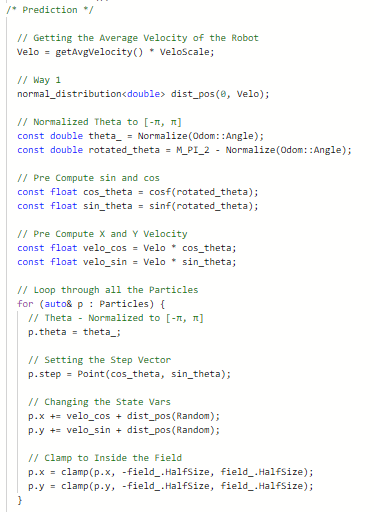
</p>

## Update

The update section of the MCL performs the weight update step, where each particle's likelihood is adjusted based on sensor measurements. The weight of each particle is computed using the **Gaussian (normal) distribution equation**, ensuring that particles more consistent with sensor readings are given higher weights.

### Breakdown of Key Steps:

1. **Measure Sensor Readings**
    - Calls the `Measure` function for each sensor, retrieving distance measurements.
2. **Filter Out Invalid Sensor Readings**
    - Sensors with valid measurements (`> -1`) are stored in `activeSensors` for further processing.
3. **Initialize Weight Sum**
    - `weights_sum = 0;`
    - Prepares for weight normalization by resetting the sum of all particle weights.
4. **Skip Weight Update If No Active Sensors**
    - `if (!activeSensors.empty())`
    - If no valid sensor data is available, the weight update step is skipped.
5. **Compute Particle Weights Based on Sensor Readings**
    - **Iterate Through Each Particle**
        - Initialize weight (`wt = 1.0`) for each particle.
    - **Predict Measurement for Each Active Sensor**
        - Uses the environment model (`field_`) to estimate what the sensor would detect from the particle’s position.
    - **Discard Particles With Invalid Predictions**
        - If the predicted sensor reading is invalid (negative distance), the particle is given a weight of `0`.
    - **Calculate the Error Between Prediction and Measurement**
        - Computes the difference between the predicted and actual sensor measurement.
    - **Update Particle Weight Using the Gaussian Distribution Equation**
        
        The Gaussian (normal) distribution is applied to model uncertainty in sensor readings:
        
        <p align="center">
          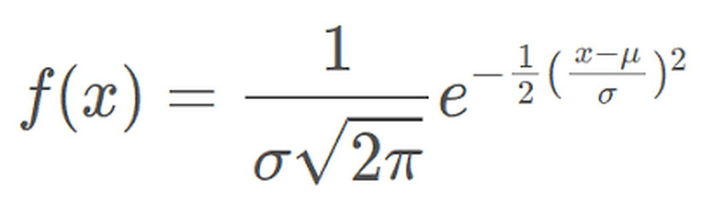
        </p>
        
        - This is implemented in the code as:
            
            ``` cpp
            wt *= exp((Deviation * Deviation) * inv_varience) * inv_base;
            ```
            
        - Where:
            - `Deviation` is the difference between the predicted and actual measurement.
            - `inv_varience` is the inverse of twice the variance (With a standard deviation of 2 inches).
            - `inv_base` is the normalization factor.

The Gaussian equation calculates how well each particle's predicted sensor measurements match the actual sensor readings, producing the weight for that particle. Particles with measurements closer to the actual measurement receive higher weights (closer to the Gaussian peak), while particles with poor matches receive lower weights, allowing the resampling step to favor more accurate guesses.

6. **Update Total Weight Sum and Assign Weights to Particles**
    - Each particle’s computed weight is stored, and `weights_sum` keeps track of the total sum of all weights.
7. **Normalize Weights to Ensure a Probability Distribution**
    - **If Total Weight Is Too Small, Reset All Weights**
        - If all weights are too small (e.g., due to numerical underflow), set each particle’s weight to an equal probability.
    - **Otherwise, Normalize All Weights**
        - Ensures that the sum of all weights equals `1.0`, maintaining a proper probability distribution.

<p align="center">
  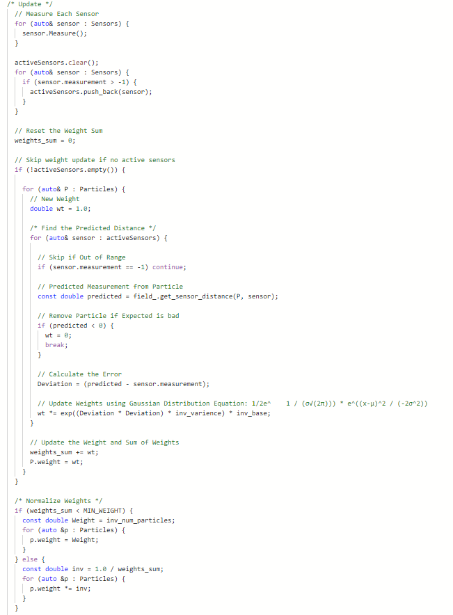
</p>

## Resampling

Resampling is crucial for Monte Carlo Localization for several reasons:

Without resampling, most particles would eventually have negligible weights, effectively wasting computational resources on particles that contribute little to the position estimate. Resampling also allows the algorithm to focus particles in regions of the state space with high probability, improving accuracy. As the robot moves and receives sensor data, resampling helps the particle distribution adapt to new information by replacing unlikely particles with more likely ones. **Resampling ensures that particles with higher weights (i.e., those that better match sensor measurements) are more likely to be chosen for the next iteration, while lower-weight particles are removed.**

For our implementation, we’re resampling using stratified resampling.
<p align="center">
  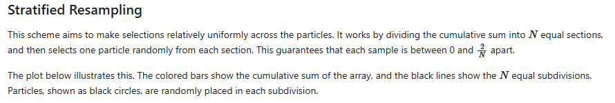
</p>

<p align="center">
  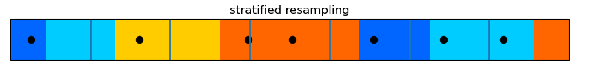
</p>

The stratified approach used in this code has advantages over simpler methods:

**Better Coverage:** By ensuring samples are drawn from each interval, stratified resampling maintains better diversity in the particle set.

**Reduced Variance:** The variance of the resampling process is reduced compared to purely random sampling.

**Preservation of Distribution Shape:** The approach better preserves the shape of the original distribution while still focusing on high-probability regions.

**Efficiency:** The implementation uses a binary search for efficient sampling, making it computationally effective.

This approach helps the MCL algorithm balance between exploration (maintaining diverse particles) and exploitation (focusing on likely positions), which is essential for robust robot localization.

### Breakdown of Key Steps:

**1. Create Cumulative Distribution Function (CDF)**

```
CDF[0] = Particles[0].weight;
for (int i = 1; i < num_particles; ++i) {
    CDF[i] = CDF[i - 1] + Particles[i].weight;
}
```

Builds a cumulative sum of particle weights, creating a probability distribution where each particle occupies a segment proportional to its weight.

**2. Generate Random Starting Points for Stratified Sampling**

```
uniform_real_distribution<double> dist(0, inv_num_particles);
```

Creates a uniform random distribution in the range ```[0, 1/N]``` where ```N``` is the number of particles.

**3. Perform Stratified Resampling**
```
for (int i = 0; i < num_particles; ++i) {
    const double Point = i * (inv_num_particles) + dist(Random);
```
 - For each new particle position ```i```, calculates a sample point by:
   - Dividing the probability space into ```N``` equal intervals of size ```1/N```
   - Adding a small random offset within each interval to avoid deterministic selection

**4. Find Corresponding Particle Using Binary Search**
```
const auto it = lower_bound(CDF.begin(), CDF.end(), Point);
const auto index = std::distance(CDF.begin(), it);
```
Uses binary search to efficiently find which particle corresponds to the generated sample point in the CDF.

**5. Store Selected Particle for Resampling**
```
Resampled.push_back(Particles[index]);
```

Adds the selected particle to the resampled collection. Particles with higher weights occupy larger segments in the CDF and are more likely to be selected multiple times.

**6. Replace Original Particles with Resampled Ones**
```
Particles.swap(Resampled);
```

### Algorithm Complexity

Time Complexity: ```O(N log N)``` due to binary search operations

Space Complexity: ```O(N)``` for storing the CDF and resampled particles


<p align="center">
  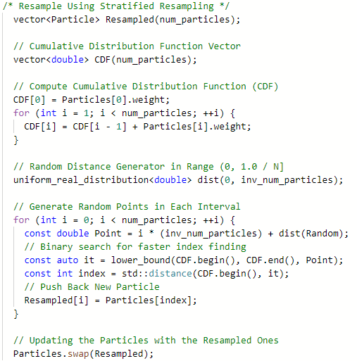
</p>

## Update Pose

This section updates the estimated pose ```(X, Y, θ)``` of the robot based on the weighted average of all particles. It ensures that the final estimated position and orientation reflect the most probable location of the robot according to the particle filter.

<p align="center">
  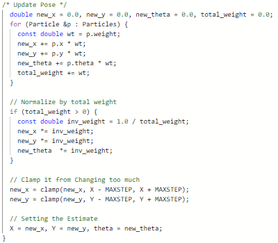
</p>

## References


> 1.  “Interactive Robotics Algorithms.” Utexas.edu, 2024, amrl.cs.utexas.edu/interactive-particle-filters/.

> 2. Mantelli, Mathias. “Particle Filter Part 1 — Introduction - Mathias Mantelli - Medium.” Medium, 5 Aug. 2023, medium.com/@mathiasmantelli/particle-filter-part-1-introduction-fb6954bc12ec.

> 3. “Particle Filter | Probabilistic Robotics.” Gitbook.io, 18 July 2019, calvinfeng.gitbook.io/probabilistic-robotics/basics/nonparametric-filters/02-particle-filter.

> 4. rlabbe. “Kalman-And-Bayesian-Filters-In-Python/12-Particle-Filters.ipynb at Master · Rlabbe/Kalman-And-Bayesian-Filters-In-Python.” GitHub, 2024, github.com/rlabbe/Kalman-and-Bayesian-Filters-in-Python/blob/master/12-Particle-Filters.ipynb. 

> 5. Wikipedia Contributors. “Monte Carlo Localization.” Wikipedia, Wikimedia Foundation, 4 July 2019, en.wikipedia.org/wiki/Monte_Carlo_localization.

> 6. Maxx Wilson | VEXU GHOST
